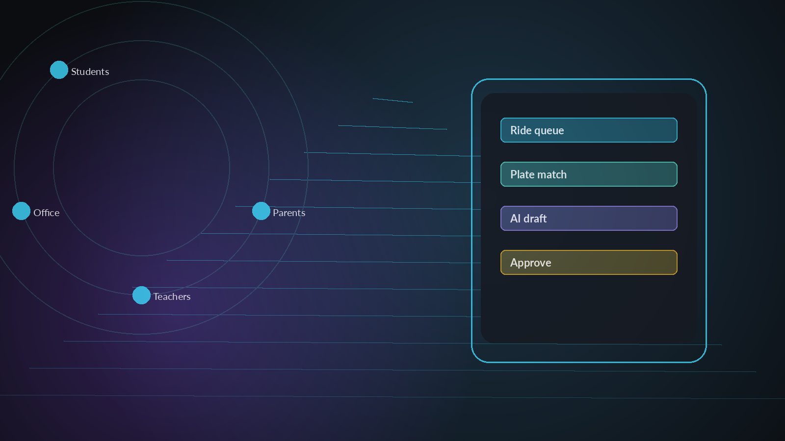
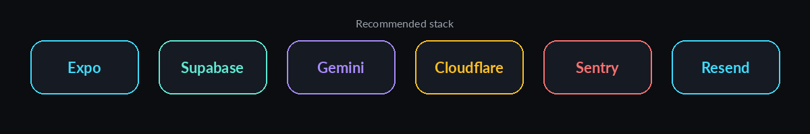
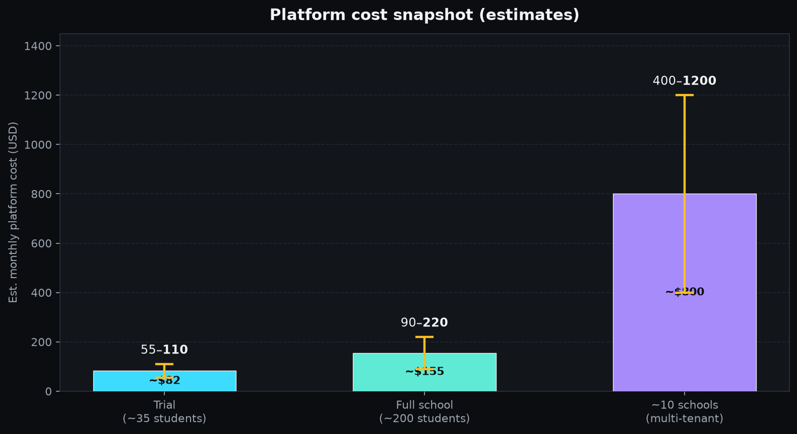
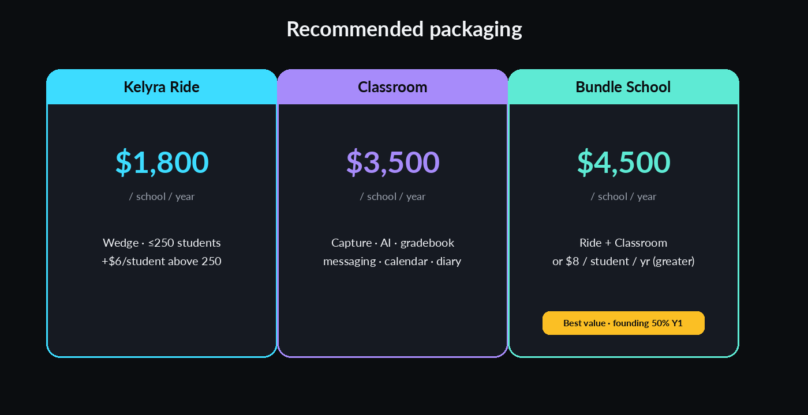
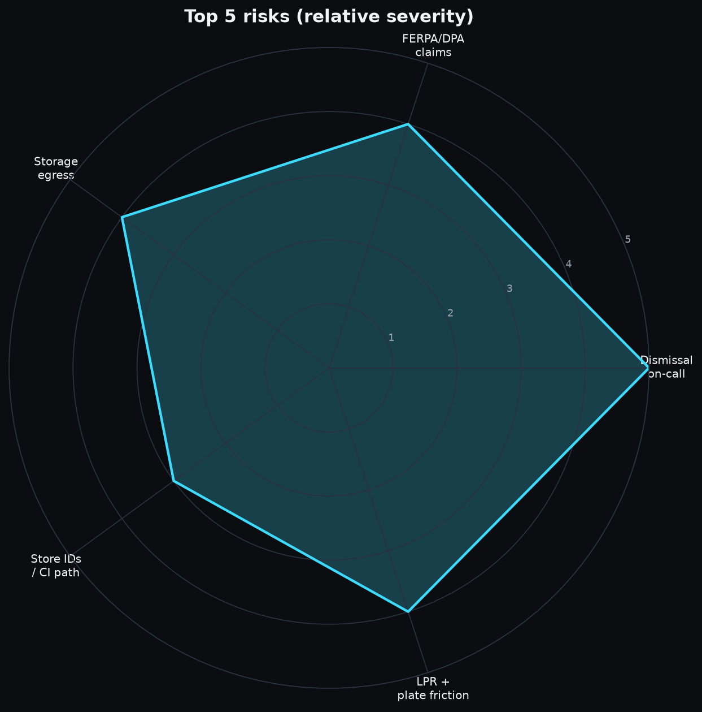
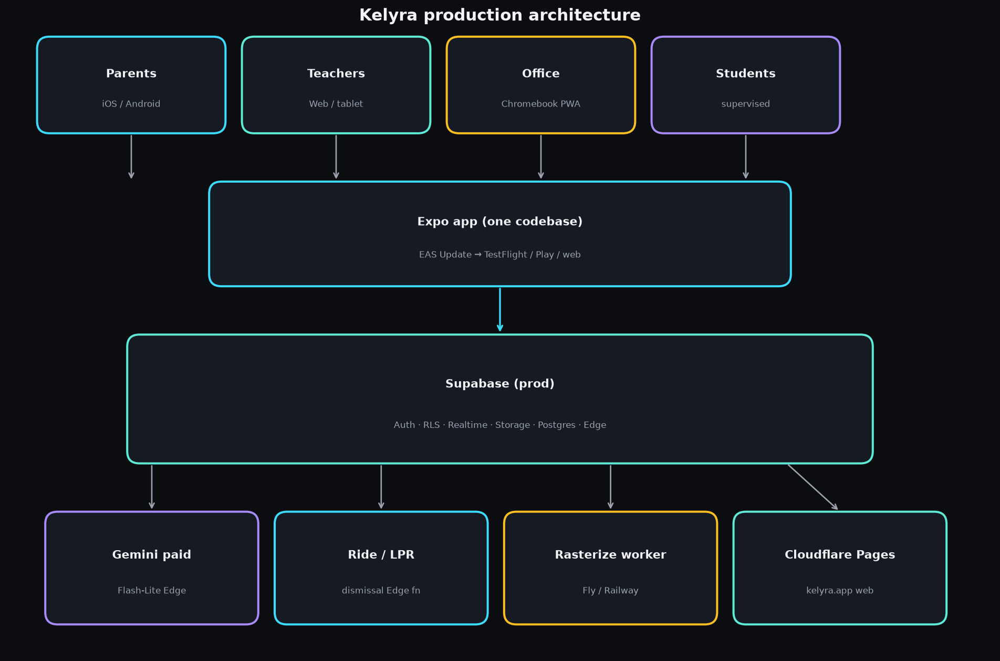
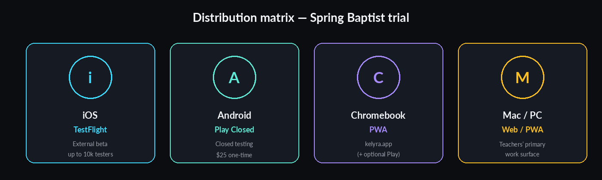
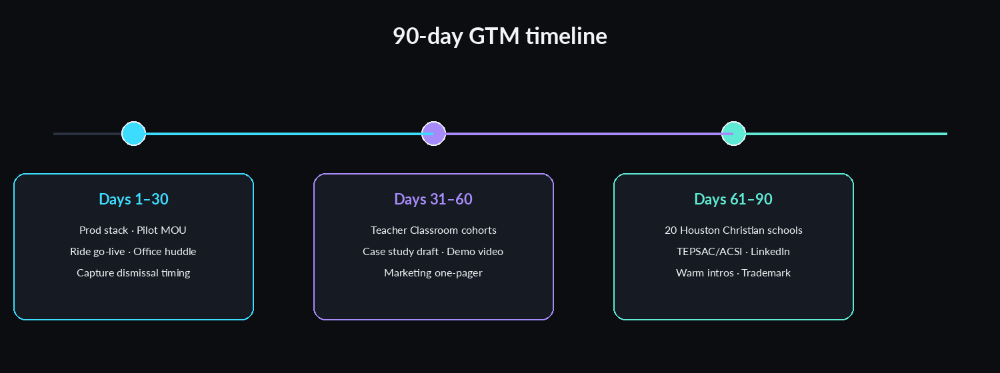
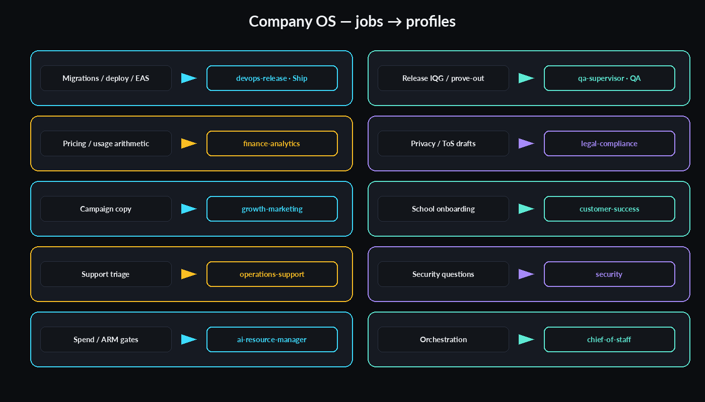

# Kelyra Production System, Monetization & Go-to-Market


*Dark visual edition cover — abstract education/tech/car-line aesthetic.*

**For:** Chuck Broaddus, founder of Kelyra  
**Date:** 2026-09-24 (America/Chicago)  
**Scope:** Spring Baptist Academy school trial → paid production; stack, cost, deploy, compliance, pricing, GTM  
**Edition:** Dark visual edition · 2026-09-24 (matching PDF/DOCX with embedded graphics)
**Method:** Read-only review of `~/projects/kelyra`, Company OS, and original research; web pricing verified 2026-09-23/24. Unverified items are flagged.

---

## 1. Executive summary

Kelyra is already a real multi-role school app (Expo + Supabase + Gemini Edge Functions + Ride/LPR), not a slide deck. The gap to a Spring Baptist trial is **ops and distribution**, not a rewrite: always-on Supabase Pro, a public web host on `kelyra.app`, store/TestFlight builds, privacy paperwork, monitoring, and a car-line–first packaging story.

### Recommended production stack (keep what you chose)


*Figure: Recommended production stack wordmarks (styled pills; not official logos).*


| Layer | Keep / change | Recommendation |
|---|---|---|
| Client | **Keep** | Expo (RN + web/PWA), one codebase |
| Backend | **Keep + harden** | Supabase Auth/Postgres/Storage/Realtime/Edge; project `aohibokgilxhqwmupdfv` → promote to **prod**; add separate **staging** project |
| AI | **Keep current Edge path** | Paid Gemini `gemini-3.5-flash-lite` via `GEMINI_API_KEY` (no training on paid tier); xAI Grok for local `ai:dev` + optional STT |
| Web host | **Add** | Cloudflare Pages (domain already on Cloudflare NS; CEO DNS HOLD still in force until you flip it) |
| Native builds | **Finish** | EAS Build/Submit/Update; fill missing `ios.bundleIdentifier` / `android.package` |
| Email | **Add** | Resend (or Postmark) custom SMTP for auth + school notifications |
| Monitoring | **Add** | Sentry + Supabase metrics + Better Stack/UptimeRobot; PostHog later |
| Rasterize worker | **Keep** | `workers/ingest-rasterize` as a small always-on container (Fly/Railway/Cloud Run) — not Edge |

### Cost snapshot (estimates — assumptions in §4)


*Figure: Est. monthly platform cost — Trial $55–110 · Full school $90–220 · ~10 schools $400–1,200.*


| Scale | Est. monthly platform cost |
|---|---|
| Trial (~35 students + teachers/office + subset of parents) | **~$55–110 / mo** |
| Full Spring Baptist (~200 students + families + staff) | **~$90–220 / mo** |
| ~10 similar schools (shared multi-tenant prod) | **~$400–1,200 / mo** |

### Recommended pricing (car line as wedge)


*Figure: Ride $1,800 · Classroom $3,500 · Bundle $4,500 (or $8/student/yr).*


- **Ride module (wedge):** **$1,800 / school / year** (or $180/mo) for ≤250 students — undercuts secondary reports of ~$3,750/yr for PikMyKid software-only; below hardware LPR platforms.
- **Kelyra School (full suite):** **$4,500 / school / year** or **$8 / student / year** (whichever greater), includes Ride + classroom AI + messaging + gradebook + Author packs for enrolled teachers.
- **Spring Baptist trial terms:** **free through end of spring semester** in exchange for case study, testimonial, and weekly office feedback; founding-school renewal at **50% of list for year 1 paid**.

### Top 10 actions

1. Upgrade org to **Supabase Pro**; create **staging** project; lock spend-cap strategy.  
2. Flip **CEO DNS HOLD** only after Privacy Policy + pilot MOU draft exist; point `kelyra.app` → Cloudflare Pages web export.  
3. Complete **EAS** identity (`bundleIdentifier` / `package`), Apple Developer + Play Console, TestFlight + Play closed testing.  
4. Wire **custom SMTP** (Resend) + paid **Gemini** billing + monthly AI spend alert.  
5. Deploy **ingest-rasterize** worker to a managed host with secrets (not laptop).  
6. Add **Sentry** + dismissal-window uptime check + Edge error alert.  
7. Sign **pilot MOU** with Spring Baptist; publish **Privacy Policy + ToS** on `kelyra.app`.  
8. Ship **Ride-first** onboarding checklist for office manager (vehicles, plates, staff walk photo).  
9. Form **TX LLC**, EIN, bank, Stripe (invoices/ACH) — sell **outside** the App Store for B2B.  
10. Automate release train + nightly usage digest via Company OS (`devops-release`, `finance-analytics`, Grok Bot Ship/QA).

### Top risks


*Figure: Relative severity of top production risks.*


1. Solo-founder on-call during **dismissal window** (3:00–4:00 PM CT) if Realtime/LPR fails.  
2. Claiming FERPA “school official” without a DPA — private school may not be FERPA-bound the same way; still need contractual privacy.  
3. Storage **egress** already burned Free plan in Aug 2026 — thumbs help; Pro is still required for always-on + parents.  
4. Missing store identifiers / no CI promotion path → slow trial installs.  
5. Car-line LPR accuracy + parent plate registration friction.

---

## 2. Where Kelyra is today (repo + original research)

### 2.1 What Chuck already chose (Aug 2026 research → architecture)

From `research/04`, `research/06`, and `docs/architecture.md`:

- **One TypeScript client:** Expo (not Flutter, not Capacitor+separate Next). Mobile = capture; web = dense teacher/office work.
- **One backend:** Supabase (Auth, Postgres, Storage, Edge, Realtime, RLS). No Nest/Rails in v1.
- **AI adapter:** Server-only keys. Original default was xAI Grok; research already named **Gemini Flash-Lite as cheapest multimodal fallback**. Live Edge code (`supabase/functions/_shared/ai.ts`) **prefers `GEMINI_API_KEY` → `gemini-3.5-flash-lite`**, else xAI. Local `npm run ai:dev` stays Grok.
- **Email:** Resend or Postmark (not SMS in MVP).
- **Hosting/builds:** EAS + Supabase cloud; Apple $99/yr + Play $25 once.
- **FERPA posture (honest):** keys server-side, private buckets, Approve gate, paid API no training — **do not claim school-official without DPA**.

### 2.2 Current stack facts (repo, 2026-09-23)

| Item | Status |
|---|---|
| Expo SDK | ~57; RN 0.86; web `output: static` |
| `eas.json` | **Exists** (dev/preview/production + submit) — contrary to older assumption |
| `app.json` | Missing **`ios.bundleIdentifier`** and **`android.package`** (store blocker) |
| Supabase project | `aohibokgilxhqwmupdfv` (dev/live combined) |
| Migrations | **144** SQL files under `supabase/migrations/` |
| Edge functions | ~20+ including `ride-lpr`, `ask-assistant`, `analyze-homework`, `lesson-host`, ingest-related, etc. |
| Storage buckets | `photos`, `audio`, `files`, `lessons` (private); ingest paths |
| Workers | `workers/ingest-rasterize` (Docker) + related ingest workers |
| Web host config | **None** (no `wrangler.toml` / `vercel.json` / `netlify.toml`) |
| Domain | `kelyra.app` on Cloudflare NS (`marissa`/`louis`); **no A/AAAA records**; Company OS **DNS HOLD** still explicit |
| Monitoring | No Sentry/PostHog config found in repo |
| Company OS | `kelyra-company-os` **v0.1.18**; Hermes profiles incl. devops-release, legal-compliance, finance-analytics, growth-marketing, customer-success, security, qa-*, etc. |

### 2.3 Usage signal (Aug 2026 Free plan — may be stale)

From `notes/storage-egress.md` (cycle ~13 Aug–13 Sep 2026):

- Egress **8.62 / 5 GB** (overage; mostly Storage), DB **~30 MB**, Storage size small (~40–230 MB depending on meter), ~3 users then.
- S1 thumbs + signed-URL cache landed to cut egress. **Current Sept meters not re-read** (CLI inspect gated); treat Aug as directional.

### 2.4 Gaps to production

1. Combined **dev/live** project — no staging promotion path.  
2. No public **web/PWA** host or custom domain wiring.  
3. Incomplete EAS/app identity for stores.  
4. Rasterize worker not documented as production-hosted.  
5. No formal Privacy Policy / ToS / pilot MOU in repo.  
6. No observability / AI spend caps / status page.  
7. Architecture doc still says “one teacher MVP”; product is already **school multi-hat** (office, Ride, calendar, messaging).  
8. Push notifications still soft-skipped in original architecture; car line may want Expo push.

---

## 3. Recommended production architecture

### 3.1 Environments

| Env | Supabase | Web | Native | Purpose |
|---|---|---|---|---|
| **dev** | Current project *or* local + personal Free | Expo web / Expo Go | Expo Go / dev client | Dogfood, Build loops |
| **staging** | New Pro Micro project | `staging.kelyra.app` Pages | Internal distribution / TestFlight Internal | School rehearsal, migrations dry-run |
| **prod** | Dedicated Pro project (promote current *or* clone + migrate) | `kelyra.app` / `app.kelyra.app` | TestFlight → ASM/MDM or public later | Spring Baptist live |

**Billing note:** One Pro org + 2 Micro projects ≈ **$25 + $10 + $10 − $10 credit = $35/mo** base ([Supabase pricing](https://supabase.com/pricing), accessed 2026-09-24).

### 3.2 Architecture (keep vs change)


*Figure: Parents/Teachers/Office/Students → Expo → Supabase → Gemini / Ride / Worker / Pages.*


```
Parents/Teachers/Office/Students
   │  iOS / Android / Chromebook-PWA / Mac-PC browser
   ▼
Expo app (one codebase) ──EAS Update (OTA JS)──► TestFlight / Play / web
   │
   ├─ Auth / RLS / Realtime / Storage signed URLs
   ▼
Supabase (prod)
   ├─ Postgres + migrations (CI apply via devops-release)
   ├─ Edge Functions (Gemini paid; ride-lpr; lesson-host; AI jobs)
   ├─ Storage private buckets (thumbs for lists)
   └─ Custom SMTP → Resend
   │
   ├─ ingest-rasterize worker (container) ← PDF stacks
   └─ Optional later: R2 mirror for hot media (zero egress) — not required for trial
```

**Keep:** Expo+Supabase+Edge AI adapter+RLS+Approve gate+private buckets+Ride design.  
**Change/add:** staging project; Cloudflare Pages for static web; production worker host; custom domain; Sentry; paid Gemini; Resend; CI promote; docs ADR restamp for multi-school.

**Do not:** rewrite to Next.js for trial; public `photos`/`lessons` buckets; free-tier Gemini in prod (training + rate limits); claim HIPAA/FERPA school-official on Pro alone (HIPAA needs Team+$BAA).

### 3.3 Why Cloudflare Pages for web

- Domain already on Cloudflare NS.  
- Static Expo export fits Pages; static asset requests free/unlimited on Pages; Workers Paid only if Functions needed.  
- EAS Hosting works but custom domain needs paid EAS plan; Cloudflare keeps web cost near $0 for trial.  
- Vercel Pro (~$20/user) is fine but redundant if Cloudflare already owns DNS.

---

## 4. Capacity & cost model

### 4.1 Explicit assumptions (estimates)

| Assumption | Trial cohort | Full school (~200) |
|---|---|---|
| Students | 35 | 200 |
| Teachers + office | 5–10 | 15–25 |
| Parent accounts (unique adults) | 40 | 280 |
| MAU (Auth) | ~80 | ~500 |
| Homework photos/day | 40 | 150 |
| Avg stored size after resize+thumb | 0.6 MB / capture set | same |
| Monthly new media storage | ~0.7 GB | ~2.5–4 GB |
| List egress (thumbs) | low teens GB | 40–120 GB |
| Edge invocations / mo | 50k–200k | 0.5–1.5M |
| AI: vision jobs / mo | 800 | 4,000 |
| Tokens / vision job (in+out blended) | ~8k in / 1k out | same |
| Dismissal peak Realtime connections | 50 | 250–400 |
| Car-line LPR calls / school day | 80 | 250 |

Gemini paid Flash-Lite: **$0.30 / 1M input**, **$2.50 / 1M output** ([Google Gemini API pricing](https://ai.google.dev/gemini-api/docs/pricing), accessed 2026-09-24). Paid tier: content **not** used to improve products.

Rough AI $:

- Trial: 800 × (8k×$0.30 + 1k×$2.50) / 1e6 ≈ **$3.9** + Ask/practice headroom → **~$8–25 / mo**.  
- Full school: 5× → **~$40–120 / mo** depending on Ask/Author volume.

### 4.2 Monthly cost tables (estimates)

**Trial**

| Line | Low | High | Notes / source |
|---|---|---|---|
| Supabase Pro (1 project) | $25 | $35 | +staging |
| Gemini paid | $8 | $25 | estimate |
| Cloudflare Pages | $0 | $5 | Workers Paid if needed |
| EAS Free / Starter | $0 | $19 | [expo.dev/pricing](https://expo.dev/pricing) |
| Resend | $0 | $20 | Free 3k/mo then Pro |
| Sentry Developer | $0 | $26 | Team if needed |
| Uptime / misc | $0 | $10 | |
| Rasterize host | $5 | $15 | Fly/Railway tiny |
| Apple Dev (amortized) | $8 | $8 | $99/yr |
| **Total** | **~$55** | **~$110** | |

**Full school (~200)**

| Line | Low | High |
|---|---|---|
| Supabase Pro + light overage buffer | $25 | $60 |
| Gemini | $40 | $120 |
| EAS Starter | $19 | $19 |
| Email / monitoring / worker | $20 | $50 |
| **Total** | **~$90** | **~$220** |

**10 schools (multi-tenant one prod):** platform often still **<$1.2k/mo** if egress controlled; AI and storage grow roughly with active teachers × homework volume. Prefer **one multi-tenant prod** + RLS `school_id` over 10 Supabase projects (10× compute).

PITR ($100/mo per 7 days) and Team ($599) are **optional** until paid multi-school / SOC2 demand — not required for private-school pilot.

---

## 5. Deployment per platform + tooling to build

### 5.1 Distribution matrix for Spring Baptist


*Figure: iOS TestFlight · Android Play Closed · Chromebook PWA · Mac/PC web.*


| Platform | Path for trial | Notes |
|---|---|---|
| iPhone (teachers/parents) | **TestFlight** external | Up to 10k external testers; Beta App Review once ([Apple TestFlight](https://developer.apple.com/testflight/)) |
| Android | Play **closed testing** track | Play Console **$25** one-time |
| Chromebook | **PWA** via `kelyra.app` (+ optional Android app from Play on ChromeOS) | Prefer PWA for office Chromebooks |
| Mac / PC | Same web/PWA | Teachers’ primary surface |
| School-managed iPads | Later: **Apple School Manager** Custom Apps + MDM | After App Review; not required day 1 |

**APK sideload:** possible for a few Android devices; avoid as primary (updates, trust).

### 5.2 Store prerequisites checklist

- [ ] Apple Developer Program ($99/yr)  
- [ ] Google Play Console ($25)  
- [ ] Set `ios.bundleIdentifier` / `android.package` / EAS `projectId`  
- [ ] Privacy Policy URL + support email  
- [ ] Camera/mic permission copy already present — keep accurate  
- [ ] Age rating / COPPA disclosures for under-13 student accounts  

### 5.3 Deploy tooling to build (devops-release owns)

1. **GitHub Actions:** typecheck → EAS Build (preview/prod) → optional Submit.  
2. **Supabase:** `supabase db push` / migration apply by **filename** to staging then prod (matches Company OS rule).  
3. **Edge deploy:** `supabase functions deploy` per env with secrets matrix (`GEMINI_API_KEY`, `LESSON_HOST_SECRET`, SMTP, etc.).  
4. **Web:** `npx expo export -p web` → Cloudflare Pages (Wrangler) on main tags.  
5. **EAS Update** channels: `staging` / `production` for OTA JS fixes without store review.  
6. **Release checklist:** IQG release evidence → Sentry sourcemaps → smoke Ride at 3 PM CT → status page note.  
7. **Worker:** container image CI → Fly/Railway with Supabase service role (never in Expo).

---

## 6. Monitoring, metrics, alerts

### 6.1 Stack

| Tool | Role | Pricing note |
|---|---|---|
| **Sentry** | Expo crash/error | Free Developer; Team ~$26/mo annual ([sentry.io/pricing](https://sentry.io/pricing/)) |
| **Supabase** | DB CPU, connections, auth, Edge logs | Pro metrics endpoint; log drain +$60 if needed |
| **Better Stack or UptimeRobot** | HTTPS uptime `kelyra.app` + health Edge | Free tiers exist |
| **PostHog** | Product analytics | Generous free tier (events) — add after trial week 2 |
| **Status page** | status.kelyra.app (Better Stack / Instatus) | Optional week 1; recommended before full school |

### 6.2 Concrete alerts (solo-founder friendly)

| Alert | Threshold | Window |
|---|---|---|
| Edge error rate | >5% of invocations | 5 min |
| `ride-lpr` failures | >3 in 5 min | Dismissal 2:45–4:15 CT **page** |
| Realtime connection errors | spike >2× baseline | Dismissal window |
| Auth failures | >20/min | 5 min |
| DB CPU | >80% for 10 min | any |
| DB connections | >80% of pooler limit | 5 min |
| Storage / egress | >70% of plan | daily |
| Gemini $ | >$50 trial / >$150 full school | monthly + mid-month |
| Rasterize worker down | healthcheck fail | 2 min |
| Web 5xx | >1% | 5 min |

**Car-line SLO (proposed):** during Mon–Fri 2:45–4:15 CT, parent check-in → staff queue update **p95 < 3 s**; LPR attempt success (plate readable + match or explicit no-match) **≥ 90%** of registered vehicles. Misses → SMS/email to Chuck + office fallback to manual name call.

**On-call reality:** You are the pager. Automate: quiet hours except dismissal window; weekend only P0. Company OS `operations-support` can triage tickets; **Chuck** owns “is Ride down for real.”

---

## 7. Security, privacy, compliance & agreements

### 7.1 Legal landscape (verify with counsel)

| Regime | Relevance to Spring Baptist (private K–12 TX) |
|---|---|
| **FERPA** | Applies to schools that receive applicable **US Dept of Ed funds**. Many private schools are **not** FERPA-covered the same way — **verify with the school**. Still treat student records as confidential by contract. |
| **COPPA** | If you collect personal info from **under-13s**, need verifiable parental consent **or** school consent as agent — design student auth accordingly. |
| **Texas SB 820 / TEC §11.175** | Cybersecurity coordinator/policies aimed at **public districts**; do not assume private schools are in-scope — still adopt good security hygiene. |
| **SCOPE Act (HB 18)** | Primarily digital service / social features & minors; review with counsel for messaging/diary surfaces. |
| **SDPC NDPA / TX-DPA** | Strong signal for districts; private schools may still ask for a short DPA. |

### 7.2 Checklist — before trial go-live

- [ ] Privacy Policy + Terms of Service on `kelyra.app`  
- [ ] Spring Baptist **Pilot MOU** (scope, data use, retention, no paid claim, screenshot rights for case study)  
- [ ] Google Gemini **paid** billing enabled (no training)  
- [ ] Supabase DPA / terms acknowledged (Pro)  
- [ ] Cloudflare, Resend, Sentry DPAs/terms as needed  
- [ ] Parent notice / consent language for Ride plates + student photos  
- [ ] Data retention: Ride stills / LPR crops retention period (align with school — e.g. 7–30 days)  

### 7.3 Checklist — before paid launch / multi-school

- [ ] TX LLC + EIN + bank + insurance (**cyber + E&O**)  
- [ ] Optional SDPC / TX-DPA template  
- [ ] Supabase **Team** only if SOC2 report / HIPAA needed (HIPAA add-on + BAA — overkill for typical K–12 grades unless PHI)  
- [ ] Vendor security questionnaire pack  
- [ ] Subprocessor list  

**Apple/Google developer agreements:** accept; for **B2B school site licenses sold via invoice/Stripe outside the app**, IAP is generally **not** required under classic “reader/B2B” patterns — confirm current Apple US anti-steering / Epic-related rules with counsel before any **consumer** parent subscription inside iOS.

---

## 8. Monetization

### 8.1 Comparable pricing (sourced / secondary)

| Product | Model | Public / reported price | Source quality |
|---|---|---|---|
| PikMyKid | School license; parent app free | FAQ: quote-based; **secondary** blog ~**$3,750/school/yr** | FAQ primary; $ figure secondary ([pikmykid.com/faq](https://www.pikmykid.com/faq), placa.ai comparison) |
| SchoolPass | Modules / quote | Not published | Primary sales-led |
| PickUp Patrol | Enrollment-based quote | Not published | |
| StudentDismiss | Flat dismissal | **$399/school/year** published | Competitor site |
| Seesaw | Schoolwide | Free starter caps; paid often **~$2.5k+** / **~$7.50–$11.95/student/yr** (secondary benchmarks) | Mixed |
| ClassDojo | Freemium | Core free; Plus ~$59.99/family/yr | Primary-ish |
| MagicSchool / CoGrader | Teacher SaaS | ~$8–$15/user/mo | Primary pricing pages (Aug research) |

### 8.2 Packaging options compared

| Model | Pros | Cons |
|---|---|---|
| Per-student / yr | Scales with size | Harder PO; feels like nickel-and-diming Christian schools |
| Per-school site license | Easy PO; matches PikMyKid | Leaves money on table at large schools |
| Freemium teacher → upsell school | Growth | Weak for Ride (needs whole-school office) |
| Modular (Ride / Classroom / Author) | Wedge clear | Billing complexity |
| Author marketplace rev share | Long-term upside | Not year-1 |

### 8.3 Recommendation

**Sell modules with a school site license:**

1. **Kelyra Ride** — $1,800/yr (≤250 students); +$6/student above 250.  
2. **Kelyra Classroom** (capture, AI, gradebook, messaging, calendar, diary) — $3,500/yr or $8/student/yr.  
3. **Bundle School** — $4,500/yr (≤250) = Ride + Classroom; founding discount available.  
4. **AI credits:** included soft cap (e.g. 5k vision jobs/yr); overage $10 / 1k jobs — protects Gemini bill.  
5. **Author packs:** free for trial teachers; later 70/30 creator split (TpT-like) — park marketplace until 5+ schools.

### 8.4 Spring Baptist trial terms (recommended)

- **Free** through end of spring semester (or 90 days, whichever longer).  
- School provides: office champion, weekly 20-min feedback, permission for anonymized metrics + named case study after success.  
- Kelyra provides: onboarding, priority Ride support during dismissal, no marketing spam to parents.  
- Conversion offer: **50% off Year 1 Bundle** if signed within 30 days of trial end; thereafter list.  
- Data export / deletion on request within 30 days if they walk away.

---

## 9. Billing & business setup

| Step | Detail |
|---|---|
| Entity | Texas **LLC** (or existing) |
| Tax ID | EIN |
| Banking | Business checking |
| Payments | **Stripe** Invoicing + ACH (schools hate cards for $4k). Card ~2.9%+$0.30; ACH lower ([stripe.com/pricing](https://stripe.com/pricing)) |
| Procurement | W-9, COI (insurance), vendor form, sometimes ACH voided check |
| Sales tax (TX) | SaaS often treated as **data processing** — **80% of charge taxable** per Comptroller pubs; confirm with CPA. Private schools may have exemption certificates — ask. |
| App stores | **Do not** put school license IAP in-app for B2B; sell on web/invoice. Parent consumer subs later = revisit IAP rules. |

Budget to form + bank + basic insurance: **~$500–2,000** up front (estimate; insurance quotes vary).

---

## 10. Markets, GTM, branding — first 90 days

### 10.1 Segments (priority order)

1. **Private / Christian K–12** (Spring Baptist archetype) — office owns car line; less SIS bureaucracy.  
2. Small charter / classical schools.  
3. Homeschool co-ops (lighter Ride).  
4. Individual teachers (Classroom only) — acquisition funnel, not Ride wedge.

### 10.2 Market size (sourced)

- NCES PSS **2023–24:** **30,553** US private schools; **~5.1M** students ([NCES / IES](https://ies.ed.gov/nces/2026/05/characteristics-private-schools-united-states-results-2023-24-private-school-universe-survey), accessed 2026-09-24).  
- Texas private + ACSI member counts: **not computed in this pass** — filter PSS public-use file when needed.  
- ACSI / TEPSAC / TAPPS networks = conference + referral channels.

### 10.3 Buyer personas

| Buyer | Pain | Message |
|---|---|---|
| Office manager | Chaotic car line, radio chaos | “Parents announce; staff see the next car; plates help.” |
| Head of school | Safety + parent satisfaction | “Accountability log who picked up whom.” |
| Teacher | Grading / homework pile | “Photo → draft → Approve.” |
| Parent | Waiting / uncertainty | Free parent app; clear status. |

### 10.4 90-day GTM


*Figure: Days 1–30 / 31–60 / 61–90 GTM phases.*


**Days 1–30:** finish prod stack; pilot MOU; Ride go-live; weekly office huddle; capture before/after dismissal time (stopwatch).  
**Days 31–60:** add 1–2 teacher Classroom cohorts; draft case study; 2-min demo video; one-pager PDF; simple `kelyra.app` marketing page.  
**Days 61–90:** outreach to 20 Houston-area Christian schools; TEPSAC/ACSI contacts; LinkedIn posts; ask Spring Baptist for warm intros; trademark search.

### 10.5 Branding basics

- Logo: you already have splash/mark work in-app — freeze a clean wordmark for web.  
- Trademark: USPTO electronic filing **~$350 per class** (TEAS Plus retired; fee schedule changed 2025) — search first; file when name sticks.  
- Budget 90 days marketing (excluding salary): **~$200–1,000** (domain already owned; video DIY; conference later).

---

## 11. Step-by-step plan

### This week (Chuck + CoS)

| # | Action | Owner suggestion |
|---|---|---|
| 1 | Decide prod vs staging project split; upgrade Pro | Chuck + `devops-release` |
| 2 | Enable Gemini paid billing; set budget alert | Chuck |
| 3 | Draft Privacy Policy + Pilot MOU skeleton | Chuck + `legal-compliance` (flag counsel) |
| 4 | Add bundle IDs to `app.json` / EAS | `senior-developer` via qa-loop |
| 5 | Inventory Ride readiness at Spring Baptist (plates, staff devices) | Chuck + school office |

### Before trial go-live

| # | Action | Owner |
|---|---|---|
| 6 | Cloudflare Pages deploy; **CEO unparks DNS** | Chuck + devops |
| 7 | TestFlight + Play closed builds to champions | devops + Chuck |
| 8 | Resend SMTP; Sentry; uptime check; dismissal alerts | devops |
| 9 | Host ingest-rasterize in cloud | devops |
| 10 | Sign MOU; parent notice for Ride | Chuck + school |
| 11 | Rehearsal dismissal (empty or staff cars) | school + Chuck |

### During trial

| # | Action | Owner |
|---|---|---|
| 12 | Daily dismissal health watch (automated) | ops automation + Chuck P0 |
| 13 | Weekly metrics digest (pickup times, AI $, errors) | `finance-analytics` + PostHog later |
| 14 | IQG / QA on critical defects only | `qa-supervisor` / Kelyra QA |
| 15 | Capture quotes + timing data for case study | `customer-success` / Chuck |

### After conversion

| # | Action | Owner |
|---|---|---|
| 16 | Stripe invoice + ACH; W-9 | Chuck |
| 17 | Paid Bundle Year 1 at founding rate | Chuck |
| 18 | Case study page; 20-school outreach list | `growth-marketing` |
| 19 | Consider Team/SOC2 only if RFPs demand | Chuck |

### Scale (3–10 schools)

| # | Action | Owner |
|---|---|---|
| 20 | Multi-tenant hardening + admin school switcher | architect + eng |
| 21 | Status page + light on-call runbook | devops |
| 22 | Optional R2 for media if egress bites | architect |
| 23 | Conference circuit (TEPSAC/ACSI) | Chuck + growth |

---

## 12. Automating with Kelyra Company OS

Map recurring production work to **existing** Hermes profiles / Grok Bot agents:


*Figure: Recurring jobs mapped to Company OS profiles / agents.*


| Recurring job | Profile / agent |
|---|---|
| Staging→prod migrations, Edge deploy, Pages, EAS | `devops-release` (+ Grok Bot **Kelyra Ship**) |
| Release IQG / prove-out | `qa-supervisor` → `qa-engineer` (+ **Kelyra QA**) |
| Market / competitor one-pagers | `research-feedback` or Grok **deep-research** / `kelyra-product-research` → file note → `strategy` or `finance-analytics` |
| Pricing arithmetic from filed notes | `finance-analytics` |
| Privacy/ToS review of filed drafts | `legal-compliance` (then human counsel) |
| Campaign copy from approved brief | `growth-marketing` |
| School onboarding checklist | `customer-success` |
| Support triage | `operations-support` |
| Security threat questions | `security` |
| Spend / ARM gates | `ai-resource-manager` |
| Orchestration | `chief-of-staff` |

### Propose new routines

1. **Nightly cost/usage report** — script pulls Supabase usage + Gemini $ → kanban note; `finance-analytics` summarizes Mondays.  
2. **Dismissal-window health watch** — cron 2:40–4:20 CT weekdays: ping Ride endpoints; on fail page Chuck.  
3. **Weekly trial metrics digest** — WAU, Ride check-ins, median pickup, Edge error %, AI $.  
4. **Release train** — Thu cut to staging; Fri QA Supervisor evidence; Mon prod (devops only).  
5. **DNS/secrets change cards** — always CEO sticky; never auto.

### Must stay Chuck decisions

- DNS unpark; spend >$100/mo new vendor; legal claims (FERPA school-official); production data deletion; pricing locks; signing MOU/contracts; App Store “submit for review”; force-push / prod destructive SQL.

---

## 13. Open questions for Chuck / Spring Baptist

1. Trial start date and whether **Ride-only** week 1 or Ride+Classroom together?  
2. Will Spring Baptist provide **school consent** for under-13 accounts, or parent-only student access?  
3. Retention period for Ride walk photos / LPR crops?  
4. Devices: office Chromebooks only, or staff phones for walk photo?  
5. Any existing dismissal vendor contract to replace?  
6. Is the school FERPA-bound (federal funds)?  
7. Preferred invoice entity name / who signs MOU?  
8. OK to use anonymized timing data publicly in a case study?  
9. Promote current Supabase project to prod, or fresh prod + migrate?  
10. SMS for car-line exceptions (Twilio) — yes/no for v1? (Email/push may suffice.)

---

## Appendix A — Sources (access ~2026-09-23/24 CT)

1. Supabase Pricing — https://supabase.com/pricing  
2. Supabase HIPAA — https://supabase.com/docs/guides/security/hipaa-compliance  
3. Supabase SOC2 — https://supabase.com/docs/guides/security/soc-2-compliance  
4. Gemini API Pricing — https://ai.google.dev/gemini-api/docs/pricing  
5. Expo EAS Pricing — https://expo.dev/pricing  
6. Cloudflare Workers/Pages Pricing — https://developers.cloudflare.com/workers/platform/pricing/  
7. Cloudflare R2 Pricing — https://developers.cloudflare.com/r2/pricing/  
8. Sentry Pricing — https://sentry.io/pricing/  
9. PostHog Pricing — https://posthog.com/pricing  
10. Resend Pricing — https://resend.com/pricing  
11. Stripe Pricing — https://stripe.com/pricing  
12. Apple TestFlight — https://developer.apple.com/testflight/  
13. Apple School Manager Custom Apps — https://support.apple.com/guide/apple-school-manager/learn-about-custom-apps-axm58ba3112a/web  
14. Texas Comptroller — Data Processing Services — https://comptroller.texas.gov/taxes/publications/94-127.php  
15. NCES Private School Universe 2023–24 — https://ies.ed.gov/nces/2026/05/characteristics-private-schools-united-states-results-2023-24-private-school-universe-survey  
16. PikMyKid FAQ — https://www.pikmykid.com/faq  
17. StudentDismiss pricing pages (SchoolPass/PickUp Patrol alternatives) — https://www.studentdismissapp.com/  
18. USPTO trademark fee changes — https://www.uspto.gov/trademarks/fees-payment-information/summary-2025-trademark-fee-changes  
19. Internal: `~/projects/kelyra/docs/architecture.md`, `research/06-stack-ai-cost-ferpa.md`, `notes/storage-egress.md`, `notes/company/EXECUTABLE_ORG.md`, `kelyra-company-os` SKILL.md v0.1.18  

### Could not fully verify in this pass

- Live Sept 2026 Supabase usage meters (CLI inspect gated).  
- Exact PikMyKid / SchoolPass / PickUp Patrol quote prices (sales-led).  
- Whether Spring Baptist receives funds that trigger FERPA.  
- Texas private-school & ACSI counts (need PSS microdata filter).  
- Current Apple US IAP anti-steering details for every B2B edge case — use counsel.  
- Gemini exact RPM/TPM for your paid tier (console-specific).  
- Twilio A2P registration timeline if SMS added later.  
- Whether ingest-rasterize is already hosted anywhere beyond Chuck’s machines.

---

*End of report.*

---

*Dark visual edition · 2026-09-24 · Confidential — Chuck Broaddus / Kelyra*
